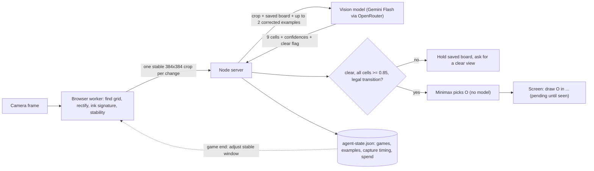
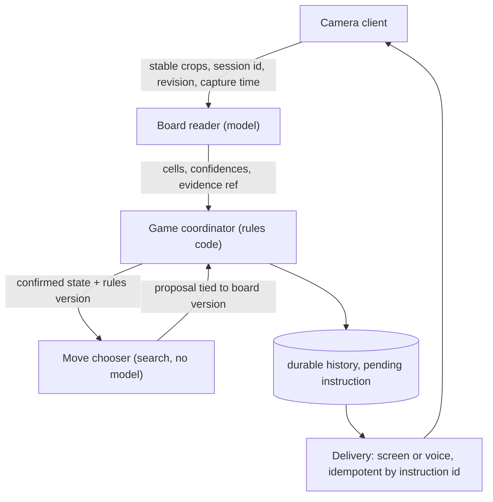
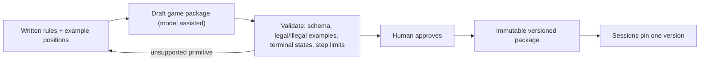
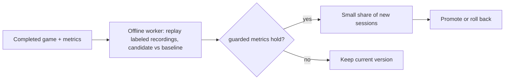

# Paperplay architecture

Three jobs: **read the board** (perception), **manage the game** (coordinator: what is confirmed on paper), and **choose a move** (search). Only the first needs a model. The rule that holds everything together: a suggested move is not a move until a reading sees it on the page.

Each section says what is **built** and what is **proposed** for a game-agnostic system. The [one-page SVG](architecture.svg) shows the same picture.

## 1. End-to-end flow

**Built.** Perception runs in two places: the classical worker on-device at about 16 fps for grid tracking and change detection, and one hosted vision call per stable change for reading the marks. Decision is exact minimax in `shared/board.helpers.ts`. The offline update is synchronous at game end: the server recomputes the capture window and writes it to the state file; the next game loads it. The demo and video modes run the classical shape classifier for reading too, so the loop works without a key.

**Proposed.** Same shape, with the reader behind an adapter: a small on-device detector first, the hosted model only for cells the detector flags as uncertain. Vendors: Gemini Flash or Claude Haiku class models for reading, a hosted frontier model only in the offline rules-drafting path. The offline path becomes a worker that replays labeled recordings and publishes approved settings, never touching live sessions.

## 2. Services and boundaries

| Service     | Owns                                                        | Needs a model                |
| ----------- | ----------------------------------------------------------- | ---------------------------- |
| Reader      | Alignment, recent crops, detector and prompt version        | Yes                          |
| Coordinator | Accepted state, turn, pending action, ordered event history | No                           |
| Chooser     | Rules package and bounded search                            | No for solved or small games |
| Delivery    | Instruction ids and acknowledgements                        | No                           |

**Built.** The boundaries exist as modules, not processes: the worker is the reader's front half, `analyze.ts` the model half, `accept-board.ts` plus `shared/accept-session.ts` the coordinator, `chooseMove` the chooser. The wire protocol already carries session id, revision, and request id. It does not yet carry capture time or alignment version, so a late result after the camera moved is not rejected.

## 3. Rules ingestion

**Proposed.** A game package is data: board topology (cells and adjacency), piece vocabulary the reader must recognize, initial setup, players and phases, legal actions, transitions, terminal conditions, and physical-completion checks (which regions must be visible before a move is accepted). Rules run in a restricted interpreter with step limits and no I/O. "Place in an empty cell, alternate, N in a line wins" covers tic-tac-toe, Gomoku, and Connect-style games by changing numbers only. Moving-piece games add source-removal checks. Nothing here is built; tic-tac-toe's board, vocabulary, win lines, prompt, and search are all hardcoded.

## 4. Shared and per-tenant

| Scope         | What lives there                                                                                    |
| ------------- | --------------------------------------------------------------------------------------------------- |
| Shared        | Engine code, package schema, public game packages, base model adapters, service endpoints           |
| Tenant + game | Private packages, corrected examples, learned capture settings, budgets, retention, pinned releases |
| Session       | Confirmed board, pending move, history, camera alignment, pinned rules/model/prompt versions        |

**Built.** One local server, one JSON file. "Tenant" is a UUID in browser local storage that keys corrected examples and capture timing. It is a convenience, not identity: any holder of a session id can call its routes. Same-origin and size checks exist; authentication does not.

**Proposed.** Authenticated identity on every request, tenant id in every storage key and cache key, PostgreSQL for ordered history and pending instructions, encrypted object storage for packages and retained evidence, explicit retention policy. The OpenRouter request already sets `data_collection: deny`; that is not a substitute for reviewing provider terms per tenant.

## 5. Feedback at scale

**Built.** One learned setting, the capture stable window (300 to 900 ms in 100 ms steps), updated only after a completed game with enough automatic checks and no rejections, failures, or corrections. Keyed by profile, model, prompt version, and algorithm name. Plus two corrected example crops per profile, used as few-shot context. Both update synchronously with no evaluation gate.

**Proposed.** Learned state is versioned and immutable per tenant and game package. Candidates are evaluated on held-out recordings from other writers and cameras before a canary, with paired per-game comparisons and reported sample counts. A bad update cannot reach live sessions because sessions pin a version and promotion is the only path. Improvement is distinguished from variance by replaying the same recordings through both policies, not by counting wins over a handful of live games.

## 6. Versioning and failure

**Built.** Every `agent-analysis` event records model name and prompt version (`paper-board-v2`); every `agent-request` records the provider request id, trigger, snapshot hash, latency, and cost. Session exports carry perception and policy version labels. Limits: 20 model calls per minute per process, 1.5 s between calls per game, 80 per game, 20 s model timeout, cumulative spend cap. File persistence is single-process; an in-memory update that fails to write is not rolled back.

**Proposed.** Pin exact reader, prompt, example set, rules package, and search versions per session, and hash artifacts so a decision is reproducible up to hosted-model nondeterminism. One durable writer per session via lease and fencing token; pending action and delivery record written in one transaction; delivery idempotent by instruction id.

**What breaks first under load.** The hosted vision call: provider quota and latency, then cost. Mitigations in order: bound concurrent calls per tenant, keep only the newest waiting crop per session, drop stale crops, circuit-break a failing provider, and push more reading onto the on-device detector so the model sees only uncertain cells. Search is not a bottleneck for solved games; for larger ones it gets a time budget and must return a legal move or pause. Lost frames or lost instructions never become moves: acknowledgement and timeouts create nothing on the paper.
