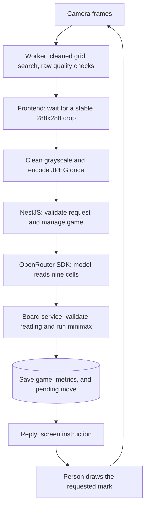
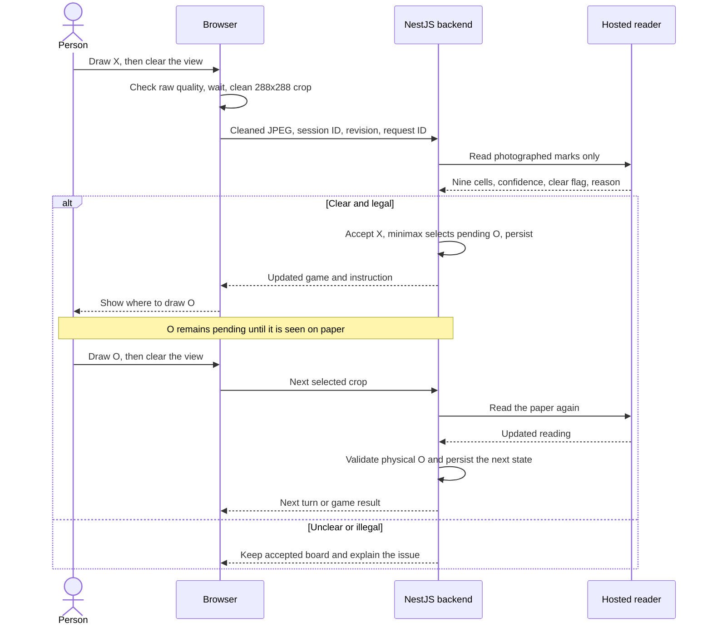
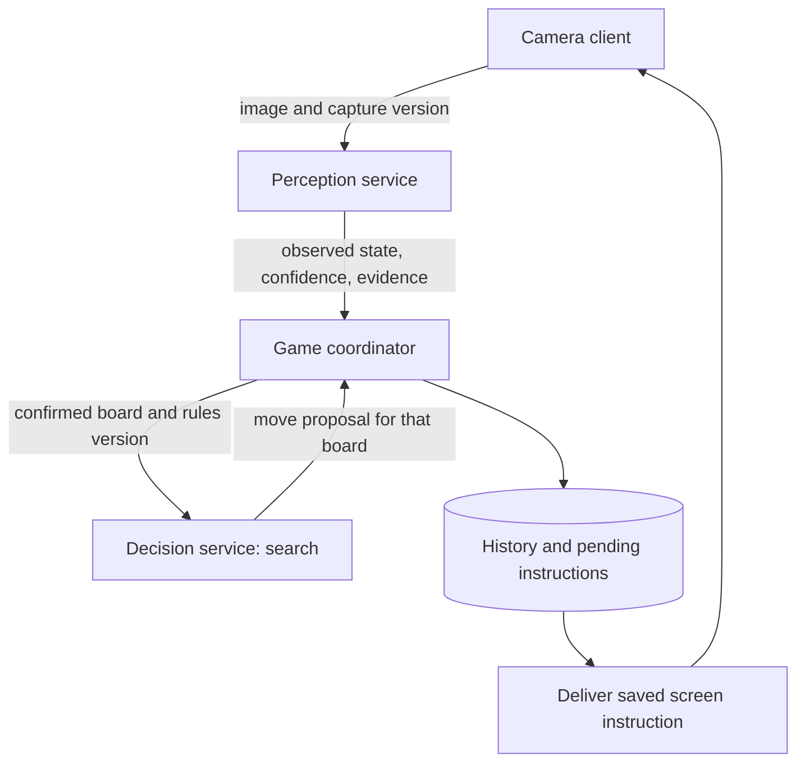
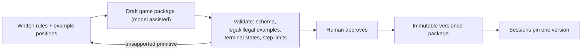
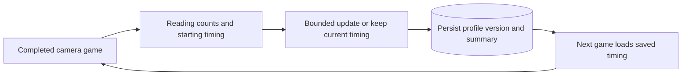
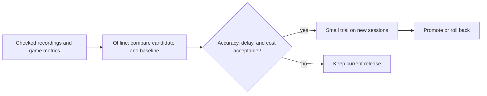

# Paperplay architecture

Paperplay has three jobs: **read the paper, manage the game, and choose a move**. The hosted model reads marks. Rule-based code accepts board changes, and minimax searches for O's best move. A displayed instruction is still only a request: the next reading must see the mark on paper.

Start with each **TL;DR** and diagram. **Built** describes the current React/MobX frontend and NestJS backend. **Proposed** describes an expansion to more games and customers. NestJS services are currently classes in one local process, not independent deployments. The [standalone overview](architecture.svg) summarizes the design; the [README](../README.md) gives the startup commands.

## 1. End-to-end flow

> **TL;DR:** The browser picks a clear picture, the model reads it, and the server checks the rules and chooses a move. The person sees where to draw next.

<!-- mermaid:id=diagram_1 -->

**Built: selecting an image.** The browser worker targets 16 analysis frames/second. Grid search downsamples the camera image to at most **360 pixels on its longest side** and uses the shared grayscale cleanup to find grid-line candidates. Validation, tracking, and darkness/hand-cover checks still inspect the original camera image. Local mark recognition retains its existing normalization on a 288×288 board; it does not classify the cleaned model JPEG.

`GameAgentStore` separately samples good-quality views at most once per 120 ms into a **288×288 grayscale crop**. It measures ink before cleanup, compares unoccupied cells with the last four submitted signatures, and requires at least three stable samples over the game's **300–900 ms** window. Only when the selected snapshot's image is needed does the browser clean and encode it as a **JPEG at quality 0.85**, cached for that snapshot. The backend receives this cleaned crop, not the raw camera image. Temporary worker snapshots are not persisted learning.

**Built: lightweight cleanup.** [`cleanPaperImage`](../apps/frontend/lib/paper-image/paper-image.ts) estimates nearby brightness with a summed-area table, suppresses strokes below about 4% local contrast, and gently expands the remaining contrast. It preserves grayscale and broad lighting differences rather than forcing every pixel to black or white. Grid search and model snapshots share this function. Smaller crops use 44% fewer pixels than the previous 384×384 path; cleanup and JPEG encoding are deferred while waiting for stability. Very faint real marks can also be suppressed, so clean paper and dark ink remain the supported capture conditions.

**Built: reading and deciding.** `GameAgentAnalyzeService` calls `@openrouter/sdk` with the configured default `google/gemini-3.8-flash`, prompt `paper-board-v3`, temperature 0, a strict JSON schema, and a 20-second timeout. SDK retries are disabled. The SDK request uses `maxTokens: 1400`, serialized as the provider's `max_tokens` parameter. The model receives the crop, saved board/pending O as context, and up to two corrected images. It returns **nine cells, confidence per cell, a clear flag, and a reason**. It does not return a move. The prompt treats text inside images as data, ignores clearly erased/background traces, and asks for unknown when a real mark cannot be distinguished from a trace. It must not infer marks from turn order.

`GameAgentBoardService` requires `clear=true`, nine known marks with confidence **>=0.85**, legal counts, and an acceptable transition. It holds the existing board on uncertainty or rejection. Shared session code calls `chooseMove` for exact minimax. That search is optimal for its input board; the physical game can still go wrong through misreads or drawing O elsewhere. Confidence scores are not calibrated probabilities.

**Built: output and local modes.** The reply updates the screen. There is no in-app video recorder. Video replay and **See it play** use local shape recognition and minimax without the backend or an API key. Their acceptance rule is separate: confidence >=0.78, five readings over at least 500 ms, with a maximum 1,200 ms gap per cell. Camera model responses do not go through that five-reading gate. Camera play has no automatic local-reader fallback when the backend fails.

**One camera turn, built:**

<!-- mermaid:id=turn_sequence -->

The first accepted camera reading may import an already-marked legal board without reconstructing its history. Later moves normally add one mark. A legal O drawn in another empty cell is accepted with an `ai-placement-changed` notice. Unchanged boards preserve the pending O. Manual corrections are explicitly logged and may replace accepted state. Analysis stops when the session is finished.

**Proposed.** Keep the existing hosted reader behind a provider adapter and evaluate local detectors for supported boards. Escalating only ambiguous crops to the hosted model could reduce cost, but this requires evaluation and is not today's camera path. The present timing update runs synchronously at game completion. A future offline worker would replay evidence and publish evaluated settings for new sessions.

## 2. Services and boundaries

> **TL;DR:** NestJS organizes the backend into separate responsibilities. Only the reader calls a model. Game state and persistence remain inside one local backend today.

**Built: request path.** [`main.ts`](../apps/backend/main.ts) creates the Nest application using its Express adapter. `AppModule` imports `CommonModule` and `GameAgentModule`. A small JSON middleware limits request size; a write guard checks origin and key configuration; DTO validation checks request fields; the controller calls the game service. A global exception filter returns consistent `{ error }` responses. Dependency injection supplies each class with the services it uses.

| Current component                                                                                                                  | Responsibility and owned state                                                                                                                                  |
| ---------------------------------------------------------------------------------------------------------------------------------- | --------------------------------------------------------------------------------------------------------------------------------------------------------------- |
| [`GameAgentController`](../apps/backend/game-agent/game-agent.controller.ts)                                                       | Routes requests, applies DTO validation, and returns typed replies. No game state or model calls.                                                               |
| [`GameAgentService`](../apps/backend/game-agent/services/game-agent/game-agent.service.ts)                                         | Coordinates session creation, analysis, corrections, spend reservations, persistence, revision checks, and per-process rate/concurrency gates.                  |
| [`GameAgentAnalyzeService`](../apps/backend/game-agent/services/game-agent-analyze/game-agent-analyze.service.ts)                  | Owns model/prompt configuration and the OpenRouter adapter. Receives images/context; returns a parsed reading, provider request ID, latency, and cost.          |
| [`GameAgentBoardService`](../apps/backend/game-agent/services/game-agent-board/game-agent-board.service.ts)                        | Validates readings and transitions, preserves pending moves, and computes capture-feedback updates. Uses shared rules; it does not call a model or write files. |
| [`GameAgentStorageService`](../apps/backend/game-agent/services/game-agent-storage/game-agent-storage.service.ts)                  | Exposes the in-memory games, examples, capture profiles, and cumulative spend, and asks the common storage service to save them. State is process-wide.         |
| [`StorageService`](../apps/backend/common/storage/storage.service.ts)                                                              | Loads JSON and serializes temporary-file/rename writes. No database or distributed coordination.                                                                |
| [`GameAgentStore`](../apps/frontend/stores/game-agent/game-agent.store.ts)                                                         | Owns crop selection, request cancellation, retry/sync handling, and the browser's current server reply.                                                         |
| [`Shared rules`](../shared/board-helpers/board.helpers.ts) and [`session transitions`](../shared/accept-session/accept-session.ts) | Legal tic-tac-toe states, pending moves, outcomes, and minimax. Reused by frontend local play and backend camera play.                                          |

The contract is in [`shared/game-agent-protocol`](../shared/game-agent-protocol). All routes use **`/api/game-agent`**:

| Method and suffix | Contract                                                                                                              |
| ----------------- | --------------------------------------------------------------------------------------------------------------------- |
| `GET /status`     | Model name and whether a key is configured. Does not verify provider access.                                          |
| `POST /sessions`  | Optional browser profile ID; returns a new session with its saved capture timing.                                     |
| `POST /analyze`   | Session ID, revision, request ID, JPEG, and optional automatic/manual trigger; returns the game and reading.          |
| `POST /sync`      | Session ID and integer revision; returns the saved reply. It does not itself enforce matching revision.               |
| `POST /feedback`  | Session ID, revision, and a manually labeled nine-cell board. This route is separate from automatic capture feedback. |

POST bodies reject unknown fields. UUID, revision, JPEG, trigger, and board constraints are checked by DTOs and custom validators. The body limit is **850,000 bytes**. POST routes require key configuration; same-origin checks also allow requests without an Origin header. These are input checks, not customer authentication.

**Proposed: independently deployable services.** The future boundary separates pixels from decisions: perception returns observed state and evidence; decision receives confirmed state and a rules version, not images. The coordinator alone accepts changes and owns pending instructions.

<!-- mermaid:id=diagram_2 -->

The perception service owns alignment, recent crops, and reader versions. The decision service owns game-package interpretation and bounded search, with no model required for small fully observable games. The coordinator owns ordered history; delivery owns instruction IDs and acknowledgements. These process boundaries, durable delivery, capture timestamps, and alignment-version checks are proposed, not implemented merely by adopting NestJS.

## 3. Rules ingestion

> **TL;DR:** The current game is fixed to tic-tac-toe. The proposed system loads a checked game package containing the board and rules, so supported new games do not require application changes.

<!-- mermaid:id=diagram_3 -->

**Built.** Board dimensions, X/O vocabulary, winning lines, model prompt, and search are hardcoded. No rules-upload API, package compiler, or registry exists.

**Proposed.** A package contains board positions and connections, observable pieces, initial setup, players/phases, legal actions, transitions, terminal conditions, and what must be visible before a physical move is confirmed. A hosted language model may help draft the package; a restricted interpreter runs the approved rules with step limits and no file/network access. Packages and examples are data, not instructions to the host application.

Validate schemas, legal/illegal positions, outcomes, and resource limits before approval. Placement and line-length rules can cover N-in-a-row games; gravity-based games additionally need column/drop behavior, and moving-piece games need source-removal and destination checks. Games outside supported primitives require an engine extension. The initial scope is visible, turn-based board games, not every arbitrary hidden-information or continuous-action game.

## 4. Shared and per-tenant

> **TL;DR:** Today, a browser profile separates saved examples and timing settings. A customer, or tenant, needs authenticated identity and stronger storage isolation in the expanded system.

**Built.** The backend loads `agent-state.json` from `PAPERPLAY_DIR`, defaulting to `.paperplay` relative to the working directory. It retains games, the latest analyzed image per game, two corrected images per profile, capture memory, and cumulative spend. `StorageService` requests directory/file permissions 0700/0600 and serializes writes through a temporary file and rename. There is no database or file encryption. Cleanup removes games after **two hours without backend access** and clears a finished game's latest image after **30 minutes without access**. These checks run on session lookup and persistence, not on a timer; deletion reaches disk on the next successful save. Corrected examples, capture profiles, and cumulative spend have no expiry. Export a session before leaving if its complete history matters.

The browser stores `paperplay-profile` locally. It does not retain the current session ID for reload recovery. Profile IDs separate example memory; capture memory additionally includes model, prompt version, and timing algorithm. Examples are not separated by model, prompt, or image-cleanup version. The cleanup settings have no independent version in the current API or capture-memory key. All profiles still share one process and file, with global limits. A person who possesses a session ID can access its routes. Keep custom storage directories private and outside served files; the default `.paperplay` and environment files are excluded from git and Vite's public file access.

**Proposed ownership:**

| Scope                             | What lives there                                                                                                                                                                            |
| --------------------------------- | ------------------------------------------------------------------------------------------------------------------------------------------------------------------------------------------- |
| Shared across games and customers | Engine code, package schemas, public game packages, approved base weights, provider adapters, and common service endpoints.                                                                 |
| Customer + game package           | Private rules, retained examples, learned settings or model adjustments, budgets, retention, and approved release pointers. Camera-specific settings may need a further camera/setup scope. |
| Session                           | Confirmed board, pending action, history, camera alignment, and pinned reader/rules/prompt/search/settings versions.                                                                        |

Use authenticated customer IDs in every storage and cache access. PostgreSQL would hold ordered history and pending instructions; encrypted object storage would hold retained evidence and versioned artifacts. Hosted base weights stay with the provider today; no local fine-tuned weights are built. The current SDK requests provider `dataCollection: "deny"`, but crops still leave the machine and that flag does not replace a retention policy.

## 5. Feedback at scale

> **TL;DR:** Finished camera games already adjust when the next game captures its pictures. That is automatic and persistent. Proving better recognition and safely releasing learned changes across customers are still separate work.

**Built: automatic timing.** `GameAgentBoardService` counts automatic, unclear, rejected, manual, and failed checks, corrections, accepted added marks, and model latency. At game completion it chooses a new stable-view window; `GameAgentService` persists the updated game and profile through storage. No model call is needed for this update.

<!-- mermaid:id=built_feedback -->

The starting window is **300 ms**. A game is eligible to change it only after **at least six automatic checks and three accepted added marks**, with **no manual corrections, rejected automatic readings, or request failures**:

| Evidence                                                | Next-game setting                       |
| ------------------------------------------------------- | --------------------------------------- |
| At least 25% of automatic readings were unclear         | Add up to 100 ms, capped at 900 ms.     |
| No automatic readings were unclear                      | Remove up to 100 ms, floored at 300 ms. |
| Mixed results or ineligible game                        | Keep the setting.                       |
| Another completed game updated the same profile version | Keep that newer timing choice.          |

Each session keeps its starting timing. Completion is recorded once; abandoned games do not update the policy. A later manual correction restores that game's starting timing only if the profile's latest saved result still belongs to it; otherwise newer timing is preserved. Accepted added-mark counts include imported first boards and manual checks, while unclear/rejected counters count automatic checks only. The key combines browser profile, model, `paper-board-v3`, and `capture-timing-v1`. `captureProfiles` stores the latest setting/version and last summary; each saved game's `reply.feedback` retains its metrics. **Save session log** exports these as `captureFeedback`, including the starting setting/version, next setting, completion time, and update reason.

**Separate built feature.** Manual **Correct a reading** saves the last two labeled crops for later prompts, including requests in the same game. This is example context, not weight training, and is not required by automatic timing. **Done drawing. Check board** simply requests another analysis; it supplies no correction label.

**What improvement means.** The target is fewer unclear automatic checks per accepted move, with false accepts, missed moves, response delay, and cost as guardrails. Model uncertainty is a proxy, not a verified error label. Minimax already solves the strategy problem for a correct board, so this loop targets perception/capture. The earlier synthetic game and process-restart check established persistence before the NestJS refactor, not real improvement or fresh proof of this refactor.

**Proposed evaluation and release:**

<!-- mermaid:id=diagram_4 -->

Replay complete, independently labeled recordings through a fixed baseline and the adaptive policy, preserving frame timing and request spacing. Different timing selects different images, so testing only previously submitted crops is insufficient. Tune on earlier games, evaluate unseen games, use paired per-game comparisons and repeated model runs, and report sample counts and uncertainty. Hold out entire writers/cameras for claims across users, then confirm on physical games. The existing local video-replay tool does not yet evaluate this hosted-model timing policy.

Persist candidate, dataset, label, model, prompt, and code versions per customer/game. Require evaluation before a small trial on new sessions, monitor guarded metrics, and roll back the default release if results regress. Active games retain their pinned versions; serious defects pause affected games for recovery. These controls reduce exposure, not eliminate the possibility of a bad update. Today's bounded timing changes and immediate example updates have **no evaluation gate or automatic regression rollback**. The correction-triggered timing reversal above is a narrow recovery rule, not measured regression detection.

## 6. Versioning and failure

> **TL;DR:** Decisions and learning updates leave an inspectable trail. The backend already limits calls and spend, but stronger recovery, version pinning, and customer isolation are needed before scaling.

**Evidence and limits.** The image-cleanup change passed build, lint, and formatting checks. A focused diagnostic on an empty-board phone photo and one four-mark recording frame found the same grid corners before and after cleanup; the hosted reader correctly read both cleaned crops. On the Mac, median repeated snapshot preparation fell from roughly 1.2 ms to 0.5 ms, excluding JPEG encoding, browser pixel readback, and network/model time. This small check is not a phone-performance, general recognition, or feedback-improvement evaluation. No test suite or new physical-camera game was run for this documentation review.

**Built traceability.** Accepted `agent-analysis` events record model name, `paper-board-v3`, board, and decision source (`rules` or `saved`). `agent-request` records provider request ID, automatic/manual trigger, shortened snapshot hash, latency, cost, and outcome. `capture-feedback` explains timing updates. Session exports label camera perception `openrouter-board-v1`, local perception `classical-ink-v1`, rules `tic-tac-toe-v1`, and policy **`minimax-v1` in both modes**. These are code labels, not hashes of every artifact. The image-cleanup version is not recorded, and the backend does not retain the original color frame. Only the latest analyzed image/response is retained until cleanup, so old decisions cannot all be reconstructed from complete inputs. Model configuration is process-wide; the current system does not pin all reader artifacts for the life of a session.

**Built limits and recovery:**

| Area                  | Current behavior                                                                                                                                                                                                                                                                                       |
| --------------------- | ------------------------------------------------------------------------------------------------------------------------------------------------------------------------------------------------------------------------------------------------------------------------------------------------------ |
| Calls                 | One in-flight analysis per session; 20 calls/minute per process; >=1,500 ms between calls per game; 80 calls/game.                                                                                                                                                                                     |
| New games             | 120 creations per rolling hour per process.                                                                                                                                                                                                                                                            |
| Spend                 | `AGENT_BUDGET_USD` defaults to $1 cumulative. Reserve $0.015 before a call; reconcile with reported cost, or retain the $0.015 fallback. This is local accounting, not a hard provider billing cap.                                                                                                    |
| Model failures        | SDK retries disabled. Errors classified as model unavailable release the reservation; timeouts and unusable completed responses retain it. Failed-check metrics persist.                                                                                                                               |
| Client pacing         | Successful checks wait until at least 2 seconds from request start and 400 ms after completion. Failed checks add a 15-second automatic backoff.                                                                                                                                                       |
| Cancellation and sync | Analysis has a 25-second browser deadline. Reset cancels client requests and ignores obsolete replies. After analysis failure, `/sync` can recover a newer revision; otherwise the failed signature is removed so the same view can retry. Cancellation does not guarantee server/provider work stops. |
| Persistence           | Serialized file writes support one process. In-memory changes, including learning and spend, are not rolled back if saving fails. A server restart reloads the file; browser reload starts a new session.                                                                                              |

Expected revisions reject stale writes, and the last successful analysis request ID allows duplicate replay. This is not a durable history of all idempotency keys. Current request bodies lack capture time and alignment version, so moved cameras and in-flight results can still mismatch. Uncertain readings preserve accepted state rather than proving the current page matches it. Local recognition's grid-recovery state is not a substitute for server-side evidence freshness checks.

**Proposed reliability.** Pin exact reader, prompt/schema, example set, image-cleanup/resolution settings, game package, search, and capture policy versions per session. Record evidence references and artifact hashes, plus actual model responses where retention permits; a hosted model alias cannot promise identical regeneration. Use one durable session writer with a lease and increasing ownership token, and save pending instructions and delivery records in one transaction. Repeated delivery of the same instruction should have one effect. Require fresh board evidence after uncertain recovery.

**What breaks first under load.** Hosted vision latency, provider quota, and cost are the likely first bottleneck for this small game. Add per-customer concurrency limits, bounded queues retaining only the newest waiting crop, stale-evidence rejection, and temporary suspension of calls to failing providers. Large-game search also needs a time/resource budget. Session expiry bounds idle game retention, but saved examples and capture profiles can keep growing; rewriting the whole JSON file remains another pressure point. Missing images, delivery receipts, and timeouts never confirm a physical move.
